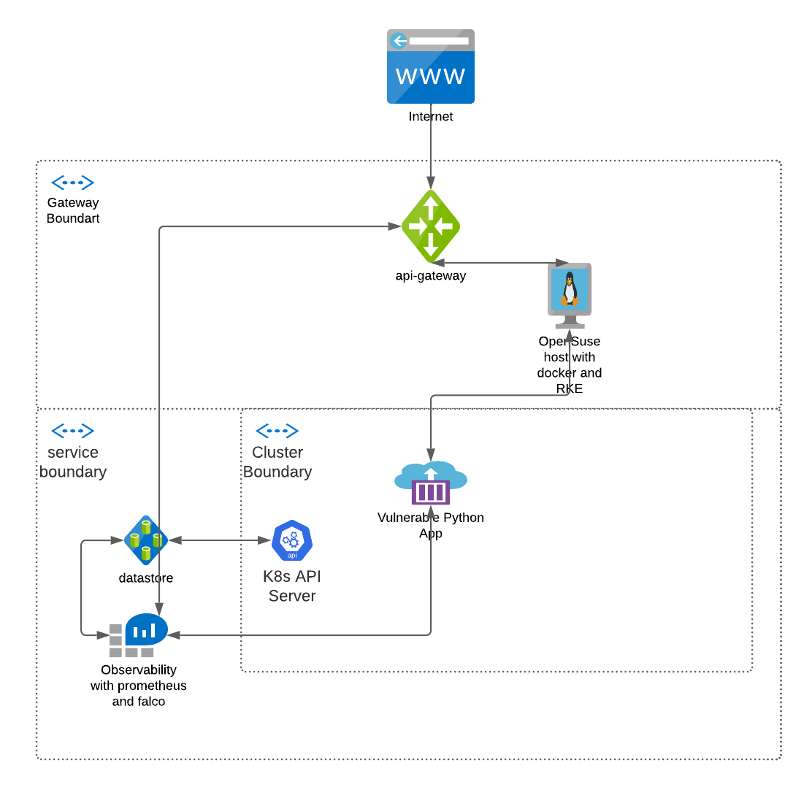
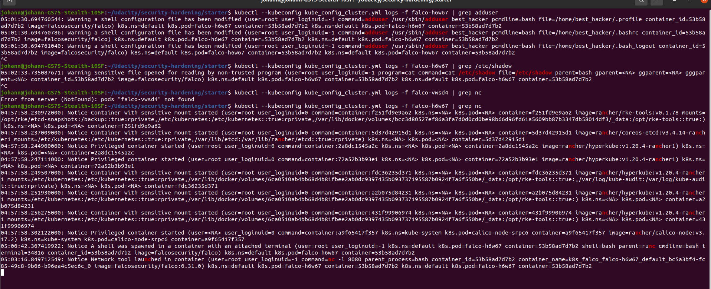

### Background
Security is a highly dynamic topic with ever changing threats and priorities. Newsworthy topics ranging from fortune 500 companies like [Garmin](https://www.wired.com/story/garmin-ransomware-hack-warning) paying $10 million in ransom for ransomware attacks to supply chain attacks such as [Solarwinds](https://www.cnet.com/news/solarwinds-hack-officially-blamed-on-russia-what-you-need-to-know) are ever-present. 

Security is becoming harder as the velocity of deployments is accelerating. The [Synopsis 2020 Open Source Security Risk Analysis Report](https://webcache.googleusercontent.com/search?q=cache:yUCraGVAdw8J:https://www.synopsys.com/content/dam/synopsys/sig-assets/reports/2020-ossra-report.pdf+&cd=1&hl=en&ct=clnk&gl=us) revealed that 99% of audited code bases contained open source, and within those codebases 75% of vulnerabilities were left unpatched, creating risk. Incorporating security checks into each step of the build and deployment process is vital to identify security defects before they hit production.

Your company CTO is worried about what your engineering team is doing to harden and monitor the company's new microservice application against malicious threat actors and payloads. You’ve completed the exercies in the course and have a baseline understanding of how to approach this. In response to the CTOs concerns students will threat model, build and harden a microservices environment based on what they learned from the exercises.

### Goal 
You will be presented with the challenge to build a secure Microservice environment, threat modeling and hardening the container image, run-time environment and application itself. For purposes of the project, you will be instructed to use a secure base opensuse image, covering considerations for the importance of using trustworthy base images and verifing the baselein. You will be provided with instructions to build, harden, ship and run an environment analogous to the company's new microservice application, simplified for project purposes. In the project you will define and build a new environment from the ground-up. 

In a real-world scenario, you may have an existing envrionment that needs to be hardened or may decided to re-build parts or all net-new, regardless, the tools and techniques in the project are directly applicable. The beauty of microservices vs a monolith architecture is that all core components (image, container, run-time, application) are abstracted allowed for isolation boundaries and iterative development. In the real-world, you could chose to harden and redeploy all base-images as one project phase and tackle docker container security, kubernetes hardening and the software composition anaylsis, as individual project phases. The best approach is to bake these requirements and security hardening into the build and deploy process. In an enterprise setting, much of this can be enforced with security units test via CI/CD prior to deployment. Hardening the base-image and baking security into the CI/CD is beyond the scope of this project and course, however please reference the [additional considerations](https://github.com/udacity/nd064-c3-Microservices-Security-project-starter/tree/master/starter#additional-considerations) section for more on this. 

For the project, once the Microservice environment is hardened and provisioned, we will configure [sysdig Falco](https://github.com/falcosecurity/falco) to perform run-time monitoring on the node, sending logs to a Grafana node for visualization. To demonstrate to the CTO that the company can respond to a real security event, you will then simulate a [tabletop cyber exercise](https://www.fireeye.com/mandiant/tabletop-exercise.html) by running a script to introduce an unknown binary from the starter code that will disrupt the environment! 

No stress, you have tools and security incident response knowledge to respond ;) Your goal will be to evaluate Grafana to determine what the unknown binary is, contain and remediate the environment, write an incident response report and present it to the CTO. There will be a few hidden easter eggs, see if you can find them for extra credit. 

### Project Instructions

Follow the steps/instructions in the Udacity classroom to complete and submit the project.

## Results:  
|                 security_architecture_design                 |              suse_docker_environment_out_of_box              |
| :----------------------------------------------------------: | :----------------------------------------------------------: |
|  |  |
|       suse_docker_environment_hardened 3.19, 3.22, 4.5       |                   kube_cluster_out_of_box                    |
|  |   |
|                    kube_cluster_hardened                     |                     kube_pods_screenshot                     |
|       |            |
|                     grype_app_out_of_box                     |                     grype_app_hardended                      |
|     |          |
|                    falco_alert_screenshot                    |                   falco_grafana_screenshot                   |
|        |    |
